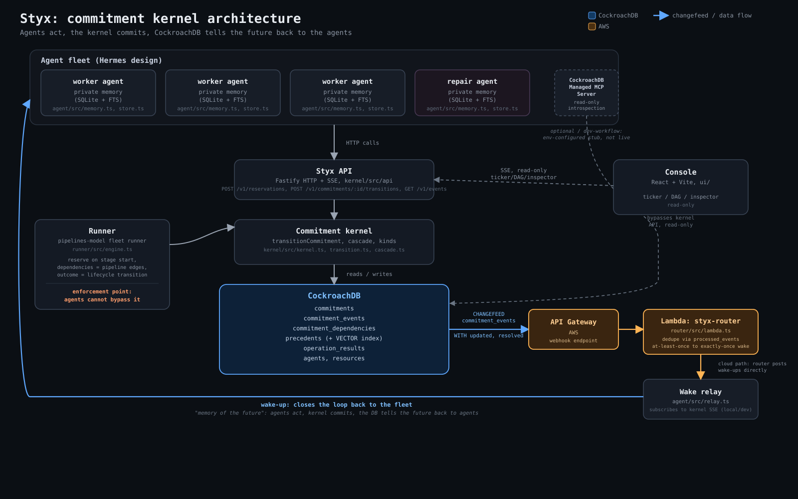

# Styx

### Durable commitments for autonomous agents

> In Greek myth, an oath sworn on the river Styx bound even the gods. Styx
> gives AI agents the same guarantee: promises stored as serializable,
> transactional state that cannot be double-spent, silently dropped, or
> accidentally broken.

**A consistency layer for promises between autonomous agents.**

Built for the CockroachDB x AWS hackathon (Build with Agentic Memory).
Live demo: **http://styx-alb-2003374125.us-east-1.elb.amazonaws.com/**

---

## The 30-second pitch

Everyone building agents is building agents that remember the past:
session logs, vector stores of prior conversations, summarized history.
That's the well-understood half of memory.

Styx is memory of the future. When one agent promises another agent
something, that promise becomes a row in CockroachDB with a lifecycle, a
version, and an audit trail, not a line in a chat transcript that both
sides hope the other read correctly.

The figure that motivates the whole project: two agents both try to claim
the same scarce resource (a GPU, a deploy slot, a backlog task) at the
same instant. Without a shared, transactional notion of "who has this,"
you get double-booking: both agents proceed, both think they own the
resource, and the conflict surfaces later as a much more expensive
failure. With Styx, exactly one of them wins a serializable transaction
and the other gets back a typed `ResourceConflict`, not silence, not a
race, a negotiation signal it can act on immediately.

Agents keep their own private memory of what happened (a Hermes-style
per-agent store). Styx is the memory they share: what has been promised,
what is still owed, and what broke.

---

## Architecture



Agents (each with private memory) call the Styx API, which calls into the
commitment kernel, which is the only thing allowed to write to
CockroachDB's commitment tables. CockroachDB emits a changefeed on every
commitment event; that changefeed reaches a Lambda router through API
Gateway, which deduplicates delivery and wakes the agents whose
obligations changed. The console reads the same API over SSE, read-only.
The fleet runner attaches directly to the kernel at the engine level, so
enforcement does not depend on any agent choosing to cooperate. The
Managed MCP Server is a second, read-only path into the same database,
for introspection.

Read path and write path are different things on purpose: writes always
go through `transitionCommitment()`, one function, one set of invariants.
Reads can go through the API, the console's SSE stream, or MCP; none of
them can mutate state.

**Design lineage**, credited, not forked: the orchestration model
(pipelines, stage outcomes, on_success/on_failure edges) is copied from
AO's pipelines v2 design; the per-agent memory design (bounded memory
file, FTS session search, compaction summaries) is copied from Hermes;
the console's event pipeline (coalesced, batched SSE flush) and seed-
palette theming approach are copied from opencode. In every case we
copied the design, not the code, and rebuilt each piece minimal for this
slice. The one place we considered porting actual code was opencode's
~300-line theme resolver; we didn't need it. `ui/src/styles/tokens.css`
uses the same seed-palette idea but implements it with native CSS
`color-mix(in oklch, ...)`, which does the same job in about a dozen CSS
custom properties instead of 300 lines of JS. No code from AO, Hermes, or
opencode is vendored anywhere in this repository.

---

## How we used CockroachDB

**Serializable transactions are the guarantee.** Every commitment write
goes through one function, `transitionCommitment()` (or the equivalent
creation path for reservations), inside a single serializable
transaction with capped exponential backoff and jitter on `40001`
(serialization failure) retries. The reservation capacity check
(`available = capacity - SUM(quantity of overlapping active/at_risk
reservations)`) runs inside that same transaction, so two agents racing
for the same resource cannot both read "capacity available" and both
write. Proof, not a claim: `kernel/test/1-race.test.ts` fires 50
concurrent reservation attempts at a capacity-1 resource. Exactly 1
succeeds, the other 49 receive a typed `ResourceConflict` with the
resource key, requested/available quantities, and the conflicting
commitment IDs, and exactly one `active` commitment exists afterward.
That test runs in CI on every push.

**Changefeeds are the nervous system.** `commitment_events` has a
changefeed pointed at a webhook sink (`CREATE CHANGEFEED FOR TABLE
commitment_events INTO 'webhook-...' WITH updated, resolved='10s',
extra_headers='...'`). In production that sink is the `styx-router`
Lambda behind API Gateway; locally it's the same Lambda code running
against a local HTTPS listener (`router/src/local.ts`). When a
transaction breaks a promise and cascades `at_risk` to its dependents,
every one of those state changes is a row in `commitment_events`, and the
changefeed ships all of them without a poller or a queue in between. The
cloud job is running against `commitment_events` on `styx-main-cluster`;
verify it live with `SHOW CHANGEFEED JOBS` filtered to `description LIKE
'%commitment_events%'` (that's exactly what `scripts/provision.sh` does
before deciding whether to create a new one, so re-running provisioning
is idempotent against an already-running feed).

**Vector index is precedents.** The `precedents` table stores past
conflict resolutions with a `VECTOR` column and an index searched by
`ORDER BY embedding <-> $1::vector LIMIT $2` (`kernel/src/precedents.ts`).
This is not a static seed set: every time the repair agent settles a
conflict, it records a new precedent, embedding included, in the same
database the commitments live in. Scene 3 is the accretion proof: run it
once, it records a precedent; run it again as a separate process, and the
second run's repair agent retrieves the exact precedent the first run
wrote, by vector similarity, not by ID lookup. Local CockroachDB builds
without `VECTOR` support skip `precedents.sql` gracefully (both the test
setup and the scenes tolerate a missing table); the cloud cluster has it.

**Managed MCP Server is the introspection read path and the dev
workflow.** `agent/src/mcp.ts` reads `STYX_MCP_ENDPOINT` /
`STYX_MCP_CREDENTIAL`; when both are set, an agent's "what do I still
owe" check (`getObligations()`) goes through the Managed MCP Server
first, read-only, and falls back to the plain API client on any failure.
This is how crash-resume (scene 4) is meant to check its own obligations
without a human handing it state. As of this submission the endpoint is
configured in the environment but the console click to activate the
CockroachDB Cloud Managed MCP Server is still pending on our end
(honest status, not a stub we're hiding: the fallback path is exercised
by every scene right now, and it's the same code path MCP would use once
switched on).

**ccloud** provisioned the cluster this all runs on:
`styx-main-cluster`, Basic tier, AWS `us-east-1`. Schema changes reach it
through `scripts/cloud-migrate.sh`, a thin wrapper around a
`styx-migrate` Lambda that re-applies `schema.sql`, `precedents.sql`, and
`router.sql` idempotently (every statement is `CREATE TABLE IF NOT
EXISTS`). `scripts/provision.sh` is the rest of the cloud setup script:
SSM parameters, the five Lambdas, the changefeed, and the ECS Fargate
deploy, all idempotent, safe to re-run.

---

## How we used AWS

- **Lambda + API Gateway**: `styx-router` receives the CockroachDB
  changefeed's webhook batches through an API Gateway HTTP API (a
  Function URL was tried first; this AWS account has a guardrail that
  403s anonymous `lambda:InvokeFunctionUrl` calls even with a correct
  resource policy, so API Gateway's `AWS_PROXY` integration is what
  actually serves the endpoint given to `CREATE CHANGEFEED`). The router
  deduplicates against a `processed_events` table before posting a
  wake-up, so at-least-once changefeed delivery becomes exactly-once
  wake-up delivery downstream.
- **ECS Fargate**: hosts the console, one task behind an ALB
  (`styx-alb`), same origin as the kernel API (no CORS to reason about).
  That's the live demo URL above. The Docker image is a two-stage build:
  the kernel's own runtime dependencies only, not the other workspaces'
  dev tooling.
- **Bedrock**: Titan Text Embeddings V2 (`kernel/src/embedders/titan.ts`)
  is the real embedder behind the precedents vector index in the cloud
  deploy (`EMBEDDER=titan`; a deterministic local stub embedder is the
  default everywhere else, same interface, so nothing else changes when
  the real embedder swaps in). Bedrock Converse is also wired as an
  optional reasoning hook (`agent/src/reason.ts`): if a model ID and AWS
  credentials are present at runtime it asks Claude on Bedrock for a
  short, structured piece of reasoning text; otherwise it falls back to a
  canned string. Nothing in the kernel's invariants depends on this
  succeeding.
- **SSM**: `/styx/database-url` and `/styx/webhook-secret` are stored as
  `SecureString` parameters, decrypted only inside the Lambdas that need
  them (via a scoped KMS key), never echoed to a terminal or a log.
- **S3 is not used.** It was on the original wishlist (see
  `docs/v1-spec.md`) for storing run artifacts; it isn't wired up, so
  it's not claimed here. `scripts/provision.sh` is the ground truth for
  every AWS resource this project actually creates, and there's no S3
  bucket in it.

---

## Quickstart

Verified from a fresh clone. All commands from the repo root unless noted.

```bash
git clone <repo-url> styx && cd styx
npm install
```

Local CockroachDB (single node, insecure, matches CI):

```bash
docker run -d --name styx-crdb -p 26257:26257 -p 8081:8080 \
  cockroachdb/cockroach:latest start-single-node --insecure
```

Wait for it to accept connections before running anything against it (the
container needs a few seconds after `docker run` returns; connecting too
early fails with "server closed the connection unexpectedly"):

```bash
for i in $(seq 1 30); do
  docker exec styx-crdb ./cockroach sql --insecure -e "SELECT 1" && break
  sleep 2
done
```

Apply the schema (requires `psql` on PATH; on macOS, `brew install libpq
&& brew link --force libpq` if it's missing):

```bash
psql postgresql://root@localhost:26257/defaultdb?sslmode=disable \
  -c "CREATE DATABASE styx;"
psql postgresql://root@localhost:26257/styx?sslmode=disable \
  -f kernel/src/db/schema.sql
psql postgresql://root@localhost:26257/styx?sslmode=disable \
  -f kernel/src/db/precedents.sql   # skips cleanly if this CockroachDB build has no VECTOR support
psql postgresql://root@localhost:26257/styx?sslmode=disable \
  -f kernel/src/db/router.sql
```

Seed demo agents and resources, then start the kernel API:

```bash
DATABASE_URL="postgresql://root@localhost:26257/styx?sslmode=disable" \
  npx tsx scripts/seed.ts
DATABASE_URL="postgresql://root@localhost:26257/styx?sslmode=disable" \
  npx tsx kernel/src/api/start.ts
```

Run a scene against it in another terminal (each scene starts its own
in-process kernel on an ephemeral port and seeds its own state, so this
doesn't need the API process above running; it's shown so you have one
live to poke at with `curl`):

```bash
DATABASE_URL="postgresql://root@localhost:26257/styx?sslmode=disable" \
  npx tsx scripts/scenes/scene1-conflict.ts
```

Run the console against your local kernel API:

```bash
cd ui
npm run dev
```

`scripts/demo/record-*.sh` wraps the same steps with reset/seed/banner
pacing for all four scenes, if you want the whole thing driven for you.

---

## The kernel: guarantees

**Lifecycle.** A commitment is created in `draft` (promises) or straight
into `active` (reservations, because the capacity check has to happen
atomically with the insert). From there:

```
draft ----activate---->  active
draft ----revoke----->   revoked
active ---fulfill---->   fulfilled
active ---break------>   broken
active ---revoke----->   revoked
active ---flag_at_risk-> at_risk        (kernel only, from a cascade)
at_risk --repair------>  active
at_risk --break-------> broken
at_risk --fulfill----->  fulfilled
```

**Transition table** (who is allowed to fire which edge):

| From | Action | To | Allowed actor |
|---|---|---|---|
| draft | activate | active | debtor |
| draft | revoke | revoked | debtor or creditor |
| active | fulfill | fulfilled | debtor |
| active | break | broken | debtor or kernel |
| active | revoke | revoked | creditor |
| active | flag_at_risk | at_risk | kernel only |
| at_risk | repair | active | kernel only |
| at_risk | break | broken | debtor or kernel |
| at_risk | fulfill | fulfilled | debtor |

Every other `(status, action)` pair is a typed `InvalidTransition` error.
Every transition also checks an expected version; a stale write gets a
typed `VersionConflict`, not a silent overwrite.

**Invariants, enforced inside the transaction that would violate them:**

- Optimistic versioning: every write checks `expectedVersion` against the
  row's current `version` under `SELECT ... FOR UPDATE`, and increments
  it on success.
- Idempotency: every kernel operation is fronted by a dedicated
  `operation_results` table (`idempotency_key` primary key, stored result
  replayed verbatim). No idempotency column on `commitments` itself; the
  check and the write happen in one transaction, and even a
  primary-key-race between two callers with the same idempotency key
  resolves to "return the winner's stored result," not an error.
- Reservation capacity is quantity- and window-aware: `available =
  capacity - SUM(quantity of overlapping active/at_risk reservations)`,
  computed inside the same serializable transaction as the write that
  depends on it. A reservation without a window is treated as blocking
  every window.
- Dependency graph is cycle-checked before a `commitment_dependencies`
  row is ever inserted (a recursive CTE walk from the proposed dependency
  back to the commitment being linked).
- Cascade is one transaction: breaking or revoking a commitment and
  flagging every transitive dependent `at_risk` happen in the same
  commit, via a recursive CTE, not a follow-up job.

**Tests.** 164 tests, all green, across five suites: kernel 73, router 3,
runner 36, agent 29, ui 23. `kernel/test/1-race.test.ts` through
`8-repair.test.ts` cover the race condition, the full transition matrix,
idempotency replay, version conflicts, cascade, cycle detection, gapless
event sequencing, and repair. Run any suite with `npm test --workspace=
<kernel|router|runner|agent|ui>`.

---

## When things go wrong

- **At-least-once delivery, dedupe.** CockroachDB changefeeds deliver
  at-least-once (retries, resolved-timestamp batching). The router
  handles this with a `processed_events` table: `INSERT ... ON CONFLICT
  DO NOTHING` on the event's row ID before doing anything else. A
  redelivered event is a no-op past that insert, so downstream wake-ups
  are exactly-once even though delivery isn't.
- **Idempotency replay.** Every kernel write operation carries an
  `Idempotency-Key`. The first call with a given key runs the operation
  and stores its result in `operation_results`, in the same transaction.
  Every subsequent call with that key gets the stored result back
  verbatim, without re-running anything, whether the retry is a network
  timeout retry from the same caller or an actual duplicate request.
- **Crash resume.** Commitments live in CockroachDB, not in an agent
  process's memory. Scene 4 demonstrates this directly: a worker process
  claims a task (the commitment becomes `active`), gets `kill -9`'d
  mid-mission, and a fresh process for the same agent identity calls
  `getObligations()`, finds the same commitment still `active`, and
  resumes it. The resource ends up with exactly one commitment against
  it, the original one, never a duplicate. The kernel never knew or
  cared that the process died; there was nothing in the agent process
  that the kernel depended on.

---

## The four scenes

Each one is a real script that seeds its own state, drives real HTTP
calls against a real kernel, and asserts pass/fail; nothing here is
staged for the video.

1. **Conflict** (`scripts/scenes/scene1-conflict.ts`): two worker agents
   claim the same backlog task at the same instant; one serializable
   transaction wins, the other gets a typed `ResourceConflict` and moves
   on to the next task.
2. **Cascade** (`scripts/scenes/scene2-cascade.ts`): breaking a
   commitment flags its dependents `at_risk` in the same transaction; the
   kernel's SSE event stream carries the change with no poller involved.
3. **Repair** (`scripts/scenes/scene3-repair.ts`): the repair agent finds
   a live-accreted precedent by vector similarity, proposes and links a
   replacement commitment, and the graph rewires. Run it twice in a row
   to see the second run retrieve what the first run recorded.
4. **Crash** (`scripts/scenes/scene4-crash.ts`): a real child process
   gets `kill -9`'d mid-claim; a fresh process for the same identity
   discovers and resumes the same obligation. Commitments outlive the
   process that made them.

Run any of them with:

```bash
DATABASE_URL="postgresql://root@localhost:26257/styx?sslmode=disable" \
  npx tsx scripts/scenes/sceneN-name.ts
```

or use the paced wrappers in `scripts/demo/record-scene*.sh`, built for
recording.

---

## Protocol roadmap

The kernel schema was built to grow without migrations, and this is the
proof, one paragraph per direction, from `docs/v3-plan.md`:

The runner grows back toward full pipelines parity and can become a
Styx-backed backend for AO pipelines upstream. The agent grows real skill
acquisition beyond the current bounded-memory, FTS-search subset. The
kernel grows a wider kind registry: lease, delegation, authorization,
escrow, SLA, each a new entry in `kernel/src/kinds/` plus a terms
validator, zero schema migrations required, because `commitments.kind`
and `commitments.terms` were built generic from day one. Conditional
commitments are a `condition` field in terms plus a guard in
`validateTransition`; the lifecycle and event log stay untouched.
Delegation and authority ("who gave this agent the right to do this?")
is answered the same way promise chains already are: by walking
commitments, not by building a second product. Multi-party settlement is
a commitment that terminally resolves a set of others in one transaction;
the cascade machinery already spans the graph. Reputation is derived,
never stored as truth: fold `commitment_events` (fulfilled vs. broken,
repaired vs. abandoned) into a score, because the audit log was the
dataset all along. The longer arc is the protocol/product split: Styx
Protocol as an open spec, hosted Styx as one implementation of it.

---

## License

Apache License 2.0. See [LICENSE](LICENSE).
